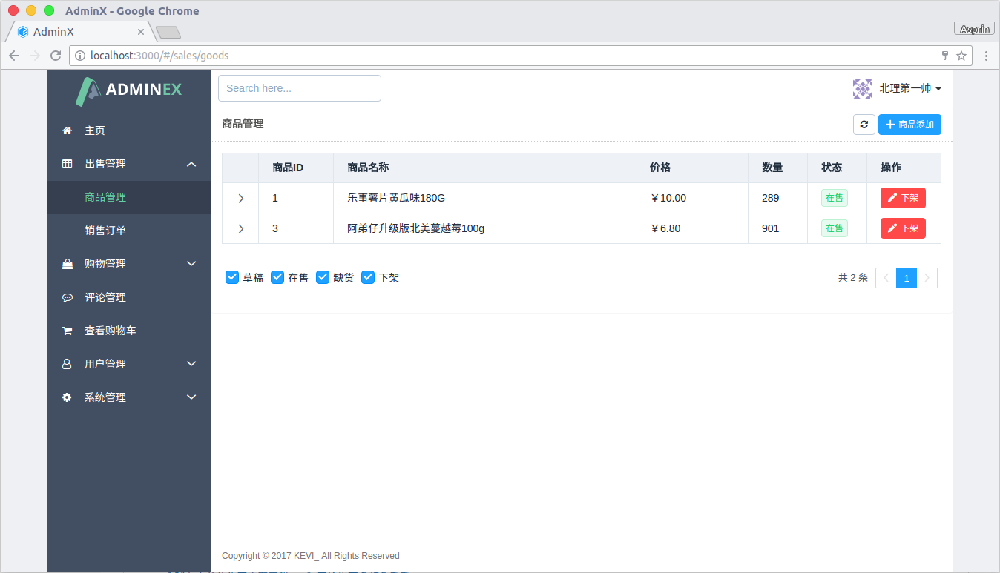
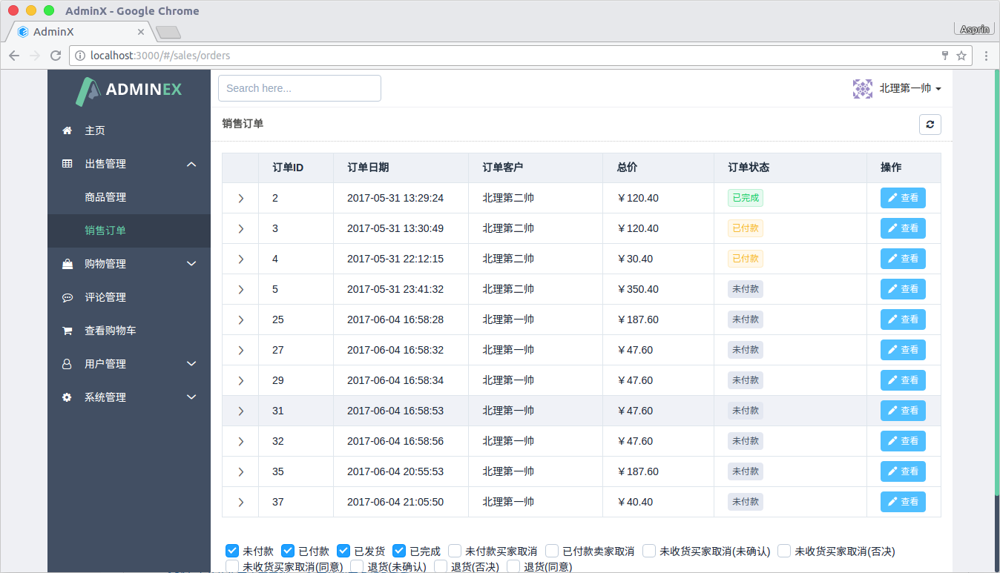
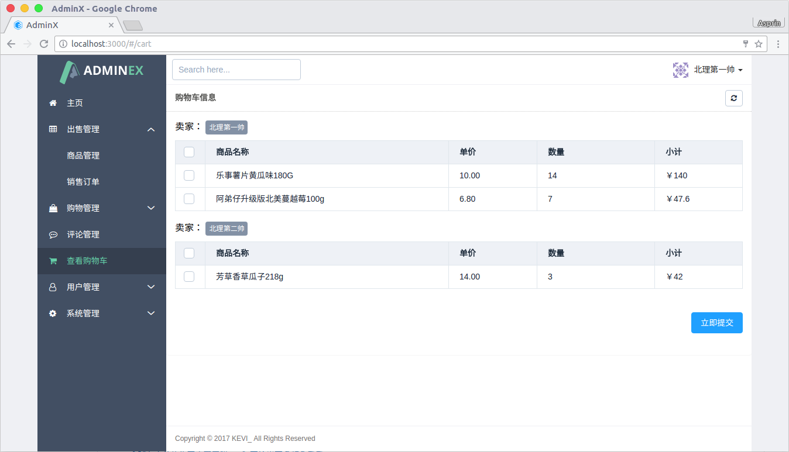
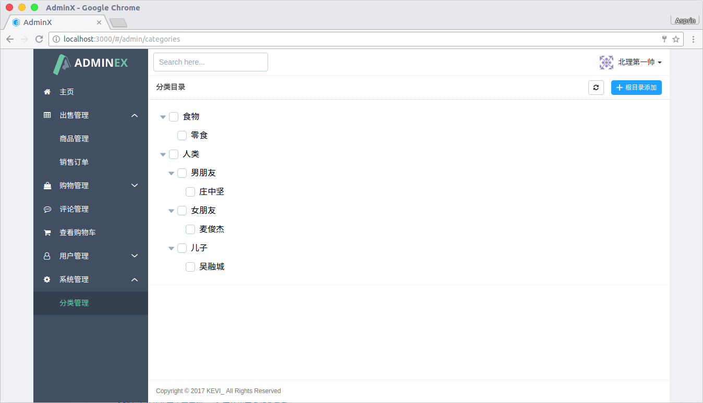

## Ariadne

一只P2P交易系统(Laravel and Vue)

 
 
 
 

**需要认证**:

```
  headers: { "Authorization": "Bearer " + access_token }
```

## 用户管理API

### 1. 获取验证码:

#### Req.:
  
  ```POST``` api/user/sendcode

  |字段|类型|必须|含义|
  |---|---|---|---|
  |name|string|√|用户店铺名|
  |phone|string|√|注册手机|

### 2. 注册:

#### Req.:

  ```POST``` api/user/register

  |字段|类型|必须|含义|
  |---|---|---|---|
  |name|string|√|用户店铺名|
  |phone|string|√|注册手机|
  |code|string|√|验证码|
  |password|string|√|用户密码|

#### Resp.:

  |字段|类型|含义|
  |---|---|---|
  |access_token|string|Access Token|
  |expires_in|int|过期时间|
  |id|int|用户ID|
  |email|Email|用户电子邮件|
  |name|string|用户店铺名|
  |phone|string|用户手机|
  |role|string|用户角色(默认member)|
  |credit|string|用户积分(暂时没用)|
  |avatar|string|用户邮箱对应的Gravatar头像(如果存在邮箱)|
  |created_at|string|注册时间|
  |updated_at|string|更新时间|

### 3. 登录:

#### Req.:

  ```POST``` api/user/register

  |字段|类型|必须|含义|
  |---|---|---|---|
  |phone|string|√|注册手机|
  |password|string|√|用户密码|

#### Resp.:
  同注册.

### 4. 注销:

#### Req.(**需要认证**):

  ```POST``` api/user/logout

### 5. 更新:

#### Req.(**需要认证**):

  ```POST``` api/user/{id}

  |字段|类型|必须|含义|
  |---|---|---|---|
  |name|string|√|用户店铺名|
  |sign|string|×|用户个性签名|
  |email|string|×|用户电子邮件|
  |password|string|×|用户密码|

#### Resp.:

  |字段|类型|含义|
  |---|---|---|
  |id|int|用户ID|
  |email|Email|用户电子邮件|
  |name|string|用户店铺名|
  |phone|string|用户手机|
  |role|string|用户角色(默认member)|
  |credit|string|用户积分(暂时没用)|
  |avatar|string|用户邮箱对应的Gravatar头像(如果存在邮箱)|
  |created_at|string|注册时间|
  |updated_at|string|更新时间|

## 商品管理API

### 1. 查看商品:

#### Req.:
   ```GET``` api/good	

  |字段|类型|必须|含义|
  |---|---|---|---|
  |by|string|×|排序KEY|
  |desc|bool|×|降序|
  |skip|int|×|跳过n条记录|
  |take|int|×|选择n条记录|
  |user|int|×|可获取用户ID下所有商品(留空获取所有)|
  |state|int|×|获取的商品状态(1:草稿, 2:在售, 4:缺货, 8:下架)|

#### Resp.:
  |字段|类型|含义|
  |---|---|---|
  |result|Array|商品列表|
  |total|int|总计|

  *商品列表构成*

  ```
[
    {
        "id": 1,
        "title": "乐事薯片黄瓜味80G",
        "desc": "好吃啊",
        "cover": "http://localhost:1088/storage/ihP4oHTCbo4tDivAccsdx5cXvp42Seiff0K9SNYe.jpeg",
        "price": "10.00",
        "total": 305,
        "unit": "包",
        "province": "广东",
        "city": "肇庆",
        "state": 4,
        "views": 22,
        "sales": 125,
        "quality": 2,
        "purchased_at": "2017-06-15 00:00:00",
        "created_at": "2017-05-31 13:10:24",
        "updated_at": "2017-06-04 20:32:08",
        "user_id": 1,
        "user": {
            "id": 1,
            "name": "北理第一帅",
            "phone": "13160662320",
            "email": "1025123978@qq.com",
            "avatar": "https://secure.gravatar.com/avatar/4c8a2a53dab9a479fb7940e1d3d2b04d?s=80&r=g&d=identicon",
            "sign": "北理第一帅",
            "credit": 0,
            "role": "admin",
            "last_login_at": "2017-06-04 15:50:03",
            "created_at": "2017-05-31 13:08:08",
            "updated_at": "2017-06-04 20:31:20"
        },
        "categories": [
            {
                "id": 1,
                "parent_id": 0,
                "name": "食物",
                "slug": "food",
                "pivot": {
                    "good_id": 1,
                    "category_id": 1
                }
            },
            {
                "id": 2,
                "parent_id": 1,
                "name": "零食",
                "slug": "snacks",
                "pivot": {
                    "good_id": 1,
                    "category_id": 2
                }
            }
        ]
    }
]
  ```


### 2. 查看单一商品:

#### Req.:
  ```GET``` api/good/{id}

#### Resp.:
  
  字段参考*商品列表构成*,并提供评论信息(*comments*)

```
{
    "id": 3,
    "title": "阿弟仔升级版北美蔓越莓100g",
    "desc": "真好吃呀。",
    "cover": "...",
    "price": "6.80",
    "total": 901,
    "unit": "包",
    "province": "江苏",
    "city": "浙江",
    "state": 2,
    "views": 11,
    "sales": 99,
    "quality": 1,
    "user_id": 1,
    "purchased_at": null,
    "created_at": "2017-05-31 13:28:54",
    "updated_at": "2017-06-04 21:05:50",
    "categories": [
        1,
        2
    ],
    "user": {
        ...
    },
    "comments": []
}
```

### 3. 创建商品:

#### Req.(**需要认证**):

  ```POST``` api/good

  |字段|类型|必须|含义|
  |---|---|---|---|
  |title|string|√|商品标题|
  |desc|string|√|商品简要内容(16字)|
  |cover|string|√|商品封面|
  |price|double|√|商品价格|
  |total|int|√|商品数量|
  |unit|string|√|商品单位名称|
  |province|string|√|商品所在省份|
  |city|string|√|商品所在城市|
  |quality|int|√|商品状态(1:全新, 2:二手)|
  |categories|Array|√|目录ID|
  |content|string|√|商品详细内容|
  |purchased_at|Date()|×|二手商品购买日期(仅限二手)|

#### Resp.:

  |字段|类型|含义|
  |---|---|---|
  |id|int|商品ID|
  |title|string|商品标题|
  |desc|string|商品简要内容(16字)|
  |cover|string|商品封面|
  |price|double|商品价格|
  |total|int|商品数量|
  |unit|string|商品单位名称|
  |province|string|商品所在省份|
  |city|string|商品所在城市|
  |quality|int|商品状态(1:全新, 2:二手)|
  |categories|Array|目录ID|
  |content|string|商品详细内容|
  |purchased_at|Datetime|二手商品购买日期(仅限二手)|
  |user_id|int|商品归属用户ID|
  |views|int|查看统计|
  |sales|int|销售统计|
  |created_at|string|创建时间|
  |updated_at|string|更新时间|


### 4. 更新商品:

#### Req.(**需要认证**):

  ```PUT``` api/good/{id}

  同创建.


#### Resp.:

  同创建.


## 订单管理API

### 1. 查看订单列表:

#### Req.:
  
  ```GET``` api/order

  |字段|类型|必须|含义|
  |---|---|---|---|
  |by|string|×|排序KEY|
  |desc|bool|×|降序|
  |skip|int|×|跳过n条记录|
  |take|int|×|选择n条记录|
  |customer|int|×|可获取用户ID下所有购买的订单(留空获取所有)|
  |merchant|int|×|可获取用户ID下所有销售的订单(留空获取所有)|
  |state|int|×|获取的商品状态(1:草稿, 2:在售, 4:缺货, 8:下架)|

#### Resp.:
  |字段|类型|含义|
  |---|---|---|
  |result|Array|订单列表|
  |total|int|总计|


  *订单列表构成*

```
{
    "id": 1,
    "sum": "10.00",
    "state": 6,
    "express_name": "顺疯快递",
    "express_code": "1025123978",
    "merchant_id": 1,
    "customer_id": 2,
    "address_id": 2,
    "created_at": "2017-05-31 13:23:54",
    "updated_at": "2017-06-03 20:52:20",
    "goods": [
        {
            "id": 1,
            "title": "乐事薯片黄瓜味180G",
            "desc": "好吃啊",
            "cover": "http://localhost:1088/storage/ihP4oHTCbo4tDivAccsdx5cXvp42Seiff0K9SNYe.jpeg",
            "price": "10.00",
            "total": 305,
            "unit": "包",
            "province": "广东",
            "city": "肇庆",
            "state": 4,
            "views": 23,
            "sales": 125,
            "quality": 2,
            "purchased_at": "2017-06-15 00:00:00",
            "created_at": "2017-05-31 13:10:24",
            "updated_at": "2017-06-04 20:44:31",
            "user_id": 1,
            "pivot": {
                "order_id": 1,
                "good_id": 1,
                "quantity": 1
            }
        }
    ],
    "address": {
        "id": 2,
        "user_id": 2,
        "name": "周杰伦",
        "phone": "01216666076",
        "province": "台湾省",
        "city": "台北市",
        "area": "中山區",
        "street": "民生東路二段149號12樓",
        "post_code": "808080",
        "created_at": "2017-05-31 13:23:42",
        "updated_at": "2017-05-31 13:23:42"
    },
    "customer": {
        "id": 2,
        "name": "北理第二帅",
        "phone": "13425294668",
        "email": null,
        "avatar": null,
        "sign": null,
        "credit": 0,
        "role": "member",
        "last_login_at": "2017-06-01 06:03:25",
        "created_at": "2017-05-31 13:16:58",
        "updated_at": "2017-06-04 15:49:19"
    },
    "merchant": {
        "id": 1,
        "name": "北理第一帅",
        "phone": "13160662320",
        "email": "1025123978@qq.com",
        "avatar": "https://secure.gravatar.com/avatar/4c8a2a53dab9a479fb7940e1d3d2b04d?s=80&r=g&d=identicon",
        "sign": "北理第一帅",
        "credit": 0,
        "role": "admin",
        "last_login_at": "2017-06-04 15:50:03",
        "created_at": "2017-05-31 13:08:08",
        "updated_at": "2017-06-04 20:31:20"
    }
}
```


### 2. 查看单一订单:

#### Req.:
  ```GET``` api/order/{id}

#### Resp.:
  
  字段参考*订单列表构成*,并提供订单操作记录(*timelines*)

```
{
    "id": 1,
    "sum": "10.00",
    "state": 6,
    "express_name": null,
    "express_code": null,
    "merchant_id": 1,
    "customer_id": 2,
    "address_id": 2,
    "created_at": "2017-05-31 13:23:54",
    "updated_at": "2017-06-03 20:52:20",
    "goods": [
    	....
    ],
    "address": {
    	....
    },
    "timelines": [
        {
            "order_id": 1,
            "state": 1,
            "operated_user_id": 2,
            "operated_at": "2017-05-31 13:23:54",
            "user": {
            	....
            }
        },
        ....
    ]
}
```

### 3. 创建订单:

#### Req.:
  
  ```POST``` api/order

  |字段|类型|必须|含义|
  |---|---|---|---|
  |address_id|int|√|用户的地址ID|
  |goods|Array|√|创建的商品列表|

*创建的订单*

  goods:[商品ID, 数量] ...

```
{
	"address_id": 1,
	"goods": [
		[1, 2],
		[2, 1],
		[3, 3]
		]
}
```

#### Resp.:
  
  创建的订单列表 Array

  这是因为商品来自的商家不一样,我们需要针对每一个商家创建一份订单..

*创建的订单列表*

```
[
    {
      "address_id": 1,
      "customer_id": 1,
      "merchant_id": 1,
      "sum": 40.4,
      "updated_at": "2017-06-04 21:05:50",
      "created_at": "2017-06-04 21:05:50",
      "id": 37
    },
    {
      "address_id": 1,
      "customer_id": 1,
      "merchant_id": 2,
      "sum": 14,
      "updated_at": "2017-06-04 21:05:50",
      "created_at": "2017-06-04 21:05:50",
      "id": 38
    }
  ]
 ```


### 4. 修改订单状态:

#### Req.:
  
  ```PUT``` api/order/{id}

  |字段|类型|必须|含义|
  |---|---|---|---|
  |state|int|√|状态(1:未付款, 2:已付款 4:已发货 8:已完成 ..)|
  |express_name|string|×|快递公司(当状态为已发货有效)|
  |express_code|string|×|邮件编号(当状态为已发货有效)|

#### Resp.:
  
  字段参考*查看单一订单*,内容差不多

```
{
    "id": 1,
    "sum": "10.00",
    "state": 2,
    "express_name": null,
    "express_code": null,
    "merchant_id": 1,
    "customer_id": 2,
    "address_id": 2,
    "created_at": "2017-05-31 13:23:54",
    "updated_at": "2017-06-04 21:42:24",
    "timelines": [
        {
            "order_id": 1,
            "state": 1,
            "operated_user_id": 2,
            "operated_at": "2017-05-31 13:23:54"
        },
        {
            "order_id": 1,
            "state": 2,
            "operated_user_id": 2,
            "operated_at": "2017-05-31 13:24:21"
        },
        {
            "order_id": 1,
            "state": 4,
            "operated_user_id": 1,
            "operated_at": "2017-06-01 05:16:17"
        },
        {
            "order_id": 1,
            "state": 6,
            "operated_user_id": 1,
            "operated_at": "2017-06-03 20:52:20"
        }
    ]
}
 ```


